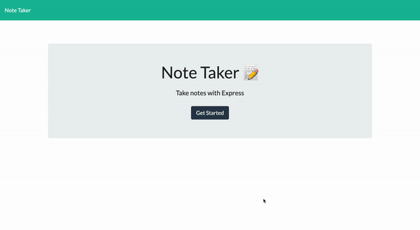
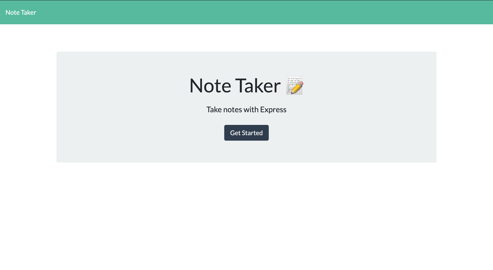
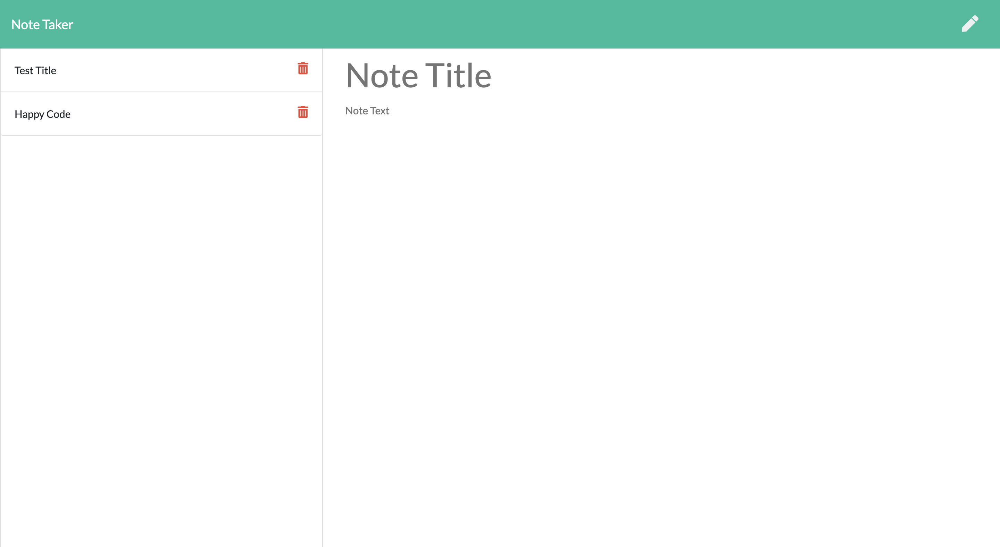

# Note-Taker

## Badges

## Description
This application can be used to write, save, and delete notes. This application use an express backend to save and retrieve note data from a JSON file. This application allows users to keep track of a lot of information, it's easy to forget or be unable to recall something important. Being able to take persistent notes allows users to have written information available when needed.

## Table of Contents
* [Description](#description)
* [Technologies](#technologies)
* [Installation](#installation)
* [Usage](#usage)
* [Contributing](#contributing)
* [Test](#test)
* [Questions](#questions)
* [Challenges](#challenges)
* [License](#license)
* [Author](#Author)
* [Badges](#badges)

## Technologies
* Node.js
* Javascript
* CSS
* GitHub
* Heroku
* Server

## Usage
run node server.js

## Contributors
I am the sole contributor to this application as of right now. If you would like to contribute to this project please reach out to me on Github or email

## Test
There aere no test designed for this app. If you would like to create test for this application, please feel free to reach out to me and let me know what test you would like to create.

## Questions
If you have questions about this repository? Please contact me at [kamara.moses@yahoo.com](mailto:kamara.moses@yahoo.com). View more of my work in GitHub at [kamara-moses](https://github.com/kamara-moses).

## Challenges
I ran into a challenge at the very beginning of the project: understanding pathing with Express. I needed to complete my understanding of the usage of path.join and the meaning of __dirname, which required deep reading into documentation of the package. On completion I was able to successfully link the frontend content to the server.

After conquering that challenge, I was then faced with another issue of the style.css not being able to load due to some MIME type error. I was able to do some research around the web to figure out why it was doing that. After coming to a set conclusion, I was able to change the path of the style.css to be able to load.

I think this was a challenging app to build but overall very information and worth my time. I learned a lot while building this application that I will use in other applications with the same requirements/build.

## License
This repository is licensed under the MIT license.

Copyright (c) [2020] [Moses Kamara]

Permission is hereby granted, free of charge, to any person obtaining a copy of this software and associated documentation files (the 'Software'), to deal in the Software without restriction, including without limitation the rights to use, copy, modify, merge, publish, distribute, sublicense, and/or sell copies of the Software, and to permit persons to whom the Software is furnished to do so, subject to the following conditions:

The above copyright notice and this permission notice shall be included in all copies or substantial portions of the Software.

THE SOFTWARE IS PROVIDED 'AS IS', WITHOUT WARRANTY OF ANY KIND, EXPRESS OR IMPLIED, INCLUDING BUT NOT LIMITED TO THE WARRANTIES OF MERCHANTABILITY, FITNESS FOR A PARTICULAR PURPOSE AND NONINFRINGEMENT. IN NO EVENT SHALL THE AUTHORS OR COPYRIGHT HOLDERS BE LIABLE FOR ANY CLAIM, DAMAGES OR OTHER LIABILITY, WHETHER IN AN ACTION OF CONTRACT, TORT OR OTHERWISE, ARISING FROM, OUT OF OR IN CONNECTION WITH THE SOFTWARE OR THE USE OR OTHER DEALINGS IN THE SOFTWARE.

## Author 

